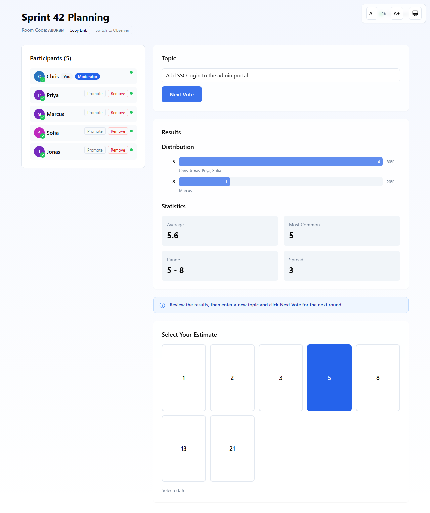
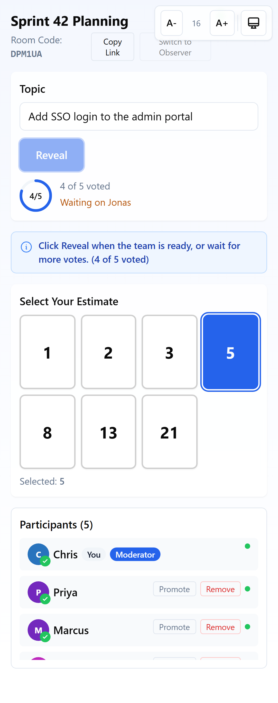
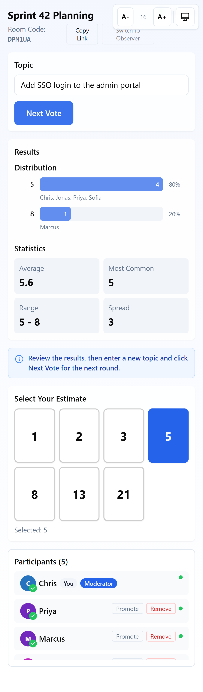
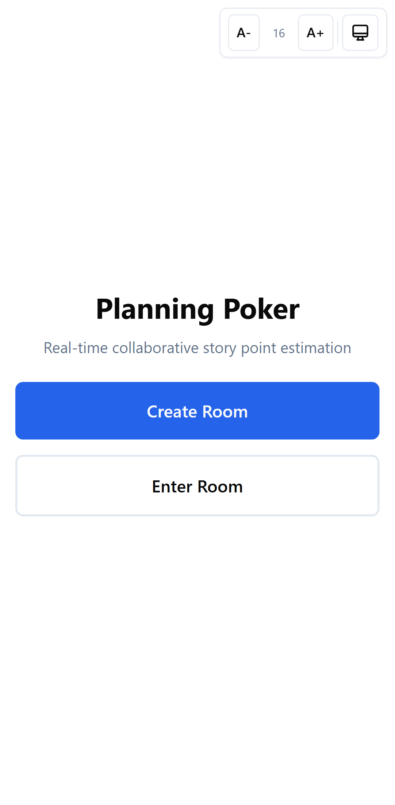

<div align="center">

# 🃏 Planning Poker

**Real-time story point estimation for agile teams. No sign-up, no database, no friction.**

Create a room, share the link, vote together, reveal at the same moment.

[**Live demo →**](https://planningpoker-cbrooksbank.azurewebsites.net)





&nbsp;

&nbsp;


</div>

---

## Why this exists

Most planning poker tools want an account, a subscription, or both. This one doesn't. Someone creates a room, everyone else opens the link, and the team is estimating within about ten seconds. Votes stay hidden until the moderator reveals them, so nobody gets anchored by the first number they see.

## Features

**Estimating**

- 🎴 **Two decks:** Fibonacci (1, 2, 3, 5, 8, 13, 21) and T-shirt sizes (XS to XXL)
- 🙈 **Hidden votes** until the moderator reveals, with a confirmation step to prevent accidental reveals
- 📊 **Distribution chart and statistics:** average, mode and range
- 🎉 **Consensus celebration** when the whole team agrees
- 🕑 **Round history** with expandable results from earlier rounds

**Running a session**

- 🔗 **Share by link or 6-character room code**
- 👑 **Multi-moderator support:** promote, step down and claim
- 🥾 **Moderator kick** for participants who shouldn't be there
- 👀 **Observer mode** for people who watch but don't vote
- 🔄 **Live presence:** see who has voted, who is connected, and who dropped off
- ♻️ **Automatic cleanup:** disconnected participants are removed after 5 minutes, and sessions expire after 12 hours

**Experience**

- ⚡ **Sub-500ms sync** across every connected client
- 🔌 **Resilient connections:** exponential-backoff reconnect, and multiple tabs per user
- 🌗 **Dark mode** and adjustable font size
- ♿ **Accessible:** keyboard navigation and screen reader support
- 📱 **Mobile-first** responsive layout, installable as a PWA

## How it works

The interesting part is the server. Next.js doesn't support WebSockets natively, so the app runs a **custom Node.js HTTP server** that wraps Next.js and serves WebSocket traffic on the same port.

```
                ┌───────────────────────────────────────────┐
  Browser ─────▶│  Custom Node HTTP server (server/index.ts)│
  (React 19)    │                                           │
     ▲          │   /api/sessions ──▶ session routes        │
     │          │   /ws?roomId&userId ─▶ WebSocket server   │
     │          │   everything else ──▶ Next.js (App Router)│
     │          └──────────────────┬────────────────────────┘
     │                             │
     └──── real-time broadcast ────┤
                                   ▼
                  In-memory session store (globalThis singleton)
                  participants · votes · statistics · history
```

Design decisions worth knowing about:

- **One port, one process.** HTTP, Next.js and WebSockets share a server, which keeps deployment to a single App Service.
- **Server-authoritative state.** Clients never decide who has voted or what the results are. They send intents and render what the server broadcasts.
- **Typed protocol.** Client and server messages are defined in `lib/websocket-messages.ts` with type guards, so both sides are checked at compile time.
- **In-memory by design.** Estimation sessions are short-lived and low-stakes, so there is no database to run. The trade-off is that restarting the server ends active sessions. See the [roadmap](ROADMAP.md) for how that changes.
- **Defensive server.** Per-connection rate limiting, 30-second heartbeats, input length limits and a participant cap per room.
- **Dual TypeScript configs.** `tsconfig.json` is for the Next.js bundler and `tsconfig.server.json` compiles the server to Node ESM. Details are in [CLAUDE.md](CLAUDE.md).

## Getting started

```bash
git clone https://github.com/ChrisBrooksbank/planningpoker.git
cd planningpoker
npm install
npm run dev
```

Open <http://localhost:3000>, create a room, then open the link in a second browser window to see it sync.

| Command                 | What it does                                           |
| ----------------------- | ------------------------------------------------------ |
| `npm run dev`           | Dev server with hot reload (HTTP and WebSocket)        |
| `npm run build`         | Production build (Next.js and server compile)          |
| `npm start`             | Run the production build                               |
| `npm run test:run`      | Run the test suite once                                |
| `npm run test:coverage` | Tests with coverage                                    |
| `npm run check`         | Typecheck, lint, format and tests, the pre-commit gate |
| `npm run screenshots`   | Regenerate the screenshots above with Playwright       |

## Project structure

```
├── app/          Next.js App Router pages and API routes
├── components/   React components (card deck, results, participants, history)
├── lib/          Shared types, WebSocket protocol, hooks, utilities
├── server/       Custom HTTP server, WebSocket server, session storage
├── __tests__/    Unit, integration, protocol and performance tests
├── e2e/          Playwright tests and screenshot capture
└── specs/        Feature specifications
```

## Quality

- Strict TypeScript, ESLint and Prettier, all enforced through `npm run check`
- Vitest suite covering components, the WebSocket protocol, multi-room isolation, join/leave during voting, and propagation-time performance
- GitHub Actions: every push to `master` runs typecheck, lint and tests, then deploys to Azure on success

## Roadmap

See [ROADMAP.md](ROADMAP.md) for what's shipped, what's next, and what's deliberately out of scope.

## License

MIT
